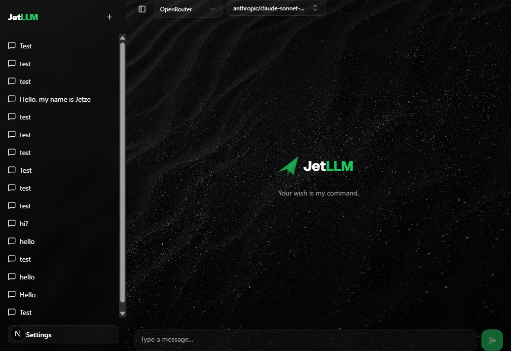
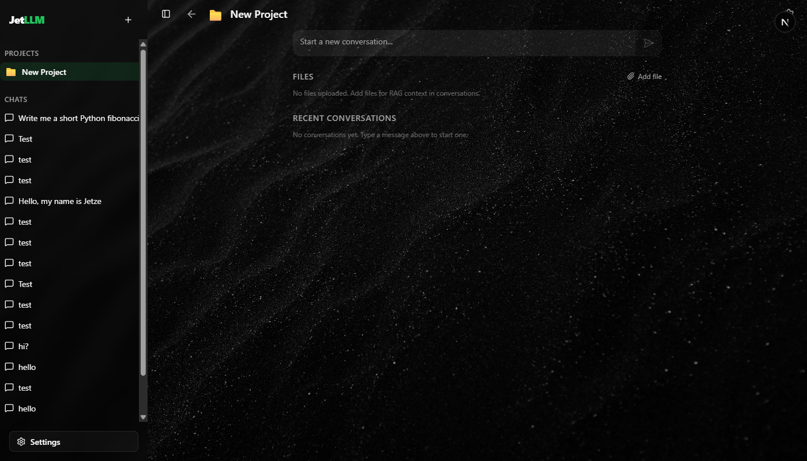
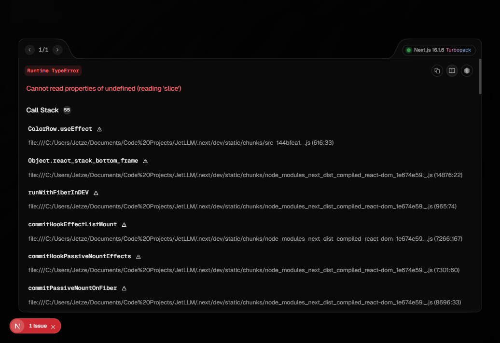

<div align="center">
  
  <h1>JetLLM</h1>
  <p><strong>A self-hosted LLM cockpit for streaming chat, memory, RAG, web search, voice input, and multi-provider model control.</strong></p>
  <p>
    
    
    
    
    
  </p>
</div>

<p align="center">
  
</p>

JetLLM is a private-first web UI for people who want their LLM workflow under their own control. Bring your own provider keys, run it locally or on a VPS, and keep conversations, memories, project documents, settings, and provider routing in your own SQLite-backed deployment.

## Highlights

| Area | What JetLLM gives you |
| --- | --- |
| Chat | Streaming conversations, regeneration, auto-titles, persisted tool output, markdown, code highlighting, and thinking-level controls. |
| Providers | OpenAI, Anthropic, Google Gemini, Mistral, Groq, OpenRouter, Together AI, and custom OpenAI-compatible endpoints. |
| Context | Memory extraction, project prompts, file attachments, and document RAG powered by SQLite plus `sqlite-vec`. |
| Tools | Tavily web search, image/text-document input, browser speech recognition, and OpenAI-compatible transcription fallback. |
| UI | AMOLED-first interface with accent colors, wallpaper, bubble style modes, theme colors, and transparency controls. |
| Deployment | Docker standalone image, persistent SQLite volume, GHCR/GitHub Actions deploy flow, and GitLab CI deploy flow. |

## Tech Stack

- Next.js 16 App Router, React 19, TypeScript strict mode.
- Tailwind CSS v4, shadcn/ui, Radix UI, lucide-react, next-themes.
- Vercel AI SDK v6 with provider packages for OpenAI, Anthropic, Google, and Mistral.
- SQLite via Drizzle ORM, `better-sqlite3`, and optional `sqlite-vec` vector search.
- Vitest for tests.
- Docker standalone production image based on `node:20-bookworm-slim`.

## Quick Start

Prerequisites:

- Node.js 20 or newer.
- npm.
- At least one LLM provider API key for chat.

Install dependencies:

```bash
npm ci
```

Start the development server:

```bash
npm run dev
```

Open http://localhost:3000 and create an account from the login screen. The local SQLite database is created automatically at `data/jetllm.db` unless `DB_PATH` is set.

## Configuration

Most app configuration is stored from the Settings UI in the SQLite `settings` table, not in environment variables.

1. Go to `Settings -> Providers`.
2. Add at least one provider API key.
3. Select a provider and model in chat.
4. Optional: add a Tavily API key to enable web search.
5. Optional: configure a RAG embedding model in `Settings -> Knowledge Base`.

Provider keys are masked from API responses, but they are stored in the SQLite database. Keep the database file and Docker volume private.

### Runtime Environment

The main runtime environment variable is:

```bash
DB_PATH=./data/jetllm.db
```

Docker sets this to `/app/data/jetllm.db` so the database lives in the persistent `jetllm-data` volume.

## Development Commands

```bash
npm run dev        # Start Next.js in development
npm run build      # Production build
npm run lint       # ESLint
npm test           # Vitest test suite
npm test -- src/app/api/chat/__tests__/chat.test.ts
npm run db:push    # Push Drizzle schema changes
npm run db:generate
npm run db:migrate
npm run db:studio
```

The app also creates and lightly migrates runtime tables on startup, but Drizzle commands are useful when changing schema definitions.

## Docker

Build and run locally:

```bash
docker compose build
docker compose up
```

The local compose file exposes the app on http://localhost:3000 and persists SQLite data in the `jetllm-data` Docker volume.

For image-based deployment, copy the deploy env example and point it at a published image:

```bash
cp .env.deploy.example .env.deploy
docker compose -f docker-compose.deploy.yml --env-file .env.deploy up -d
```

## Deployment

Supported deployment guides:

- [GHCR and GitHub Actions VPS deploy](docs/deploy-vps-ghcr.md)
- [GitLab CI VPS deploy](docs/deploy-vps-gitlab.md)

The production image uses Next standalone output and keeps SQLite at `/app/data/jetllm.db`. If you run JetLLM behind a reverse proxy, keep websocket and streaming-friendly proxy settings enabled.

## Screenshots

<p>
  
  
</p>

## Project Structure

```text
src/app              Next.js routes and API endpoints
src/components       Chat, settings, auth, app shell, and shared UI
src/hooks            Client-side data and UI hooks
src/lib              Auth, settings, providers, chat, memory, RAG, DB services
src/lib/db           Drizzle schema and SQLite bootstrap
docs                 Deployment guides and historical implementation plans
public               PWA assets, service worker, wallpaper, icons
```

Important API areas:

- `src/app/api/chat` streams assistant responses and persists assistant output.
- `src/app/api/conversations` manages conversations and messages.
- `src/app/api/projects` manages projects and documents.
- `src/app/api/settings` stores non-provider app settings.
- `src/app/api/providers` stores provider configs and lists models.
- `src/app/api/auth` handles signup, login, logout, and sessions.
- `src/app/api/speech/transcribe` handles speech-to-text fallback.

## Security Notes

- Sessions use random tokens; only SHA-256 token hashes are stored in SQLite.
- Cookies are HTTP-only, `SameSite=Lax`, and secure in production.
- Provider API keys are never returned raw by the provider config API.
- Signup is available from the login screen. For public internet exposure, put the app behind trusted access or add a registration control before relying on it for private use.
- SQLite contains user data, chat history, memories, documents, settings, and provider secrets. Back it up and protect it accordingly.

## Troubleshooting

- Port `3000` already in use: stop the existing process or change the host port in Docker compose.
- RAG unavailable: confirm `sqlite-vec` is installed and the production image includes the Linux `sqlite-vec` package.
- Web search unavailable: add a Tavily key in `Settings -> Providers`.
- Speech-to-text unavailable: add a Groq, OpenAI, or custom OpenAI-compatible provider key.
- Provider errors: confirm the provider key, base URL, and selected model are compatible.

## License

No license is currently declared.
